# Setup Equaliser in Windows 11 using Equalizer APO with Peace and AutoEQ

## Introduction

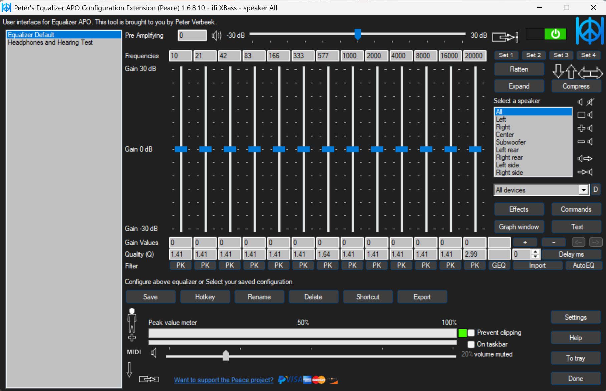

## Requirements

### Software
 - Equalizer APO
 - Peace
 - Web browser with internet access for AutoEQ

## Guide

### 1. Setup Equalizer APO

1. Download Equalizer APO

Link: <https://sourceforge.net/projects/equalizerapo/>

2. Install Equalizer APO

Run the downloaded `.exe` file and complete the setup.

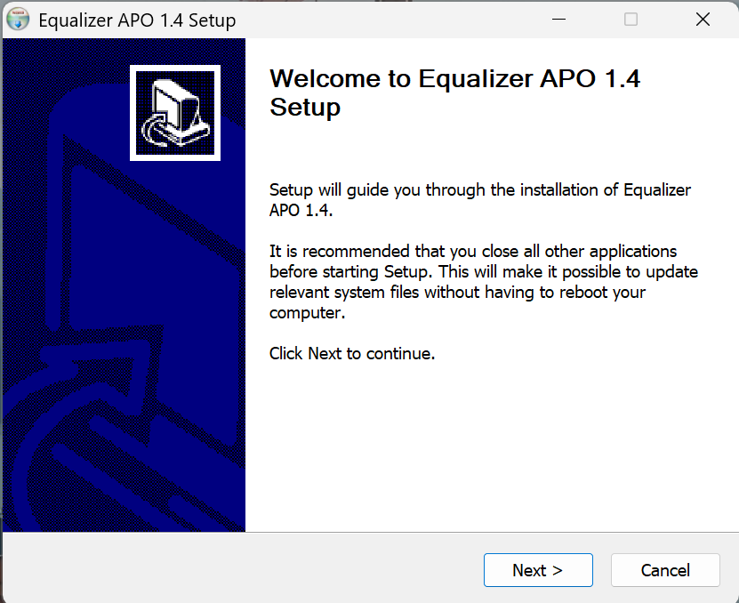

3. Install Equalizer APO for device(s)

The Equalizer APO Device Selector window should appear after completing the setup.

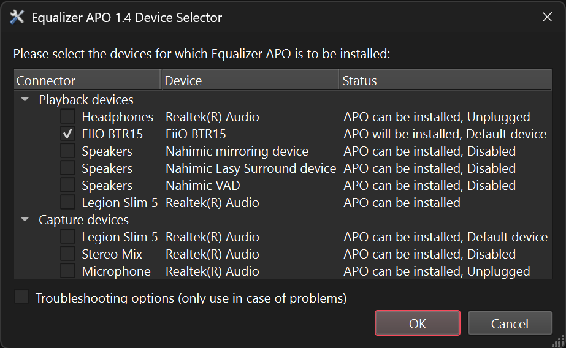

Select the device(s) you want to EQ and click `Ok`.

> [!NOTE]
> Equalizer APO Device Selector can be accessed again anytime. To access it, navigate to `Windows Search` > `Equalizer APO Device Selector`.

> [!WARNING]
> Ensure that your selected audio device has the `Audio enhancements` property set to `Device Default Effects` in Windows Settings.
>
> This allows Equalizer APO effects to be applied to the system.
>
> 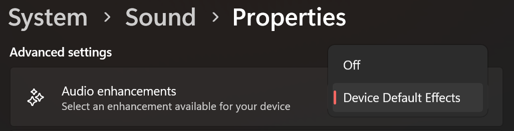

### 2. Setup Peace

1. Download Peace

Link: <https://sourceforge.net/projects/peace-equalizer-apo-extension/>

2. Install Peace

Run the downloaded `.exe` file and complete the setup.

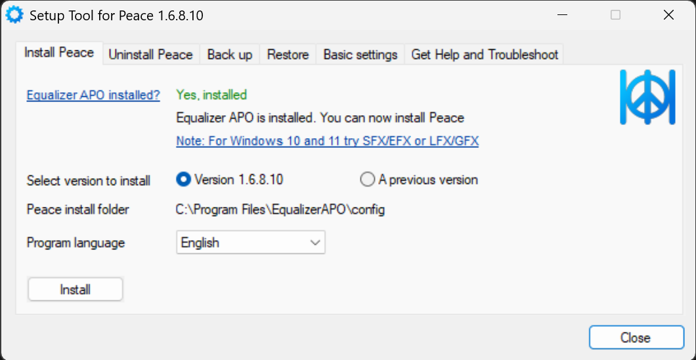

3. Open Peace

Open Peace after completing the setup.

The Interface selection prompt should appear upon startup.

Click on `Full interface`

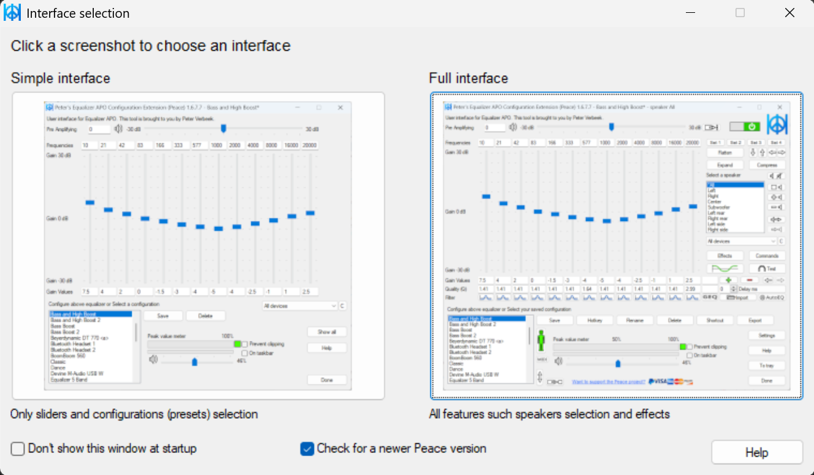

The default interface of Peace should appear.

4. Customise Peace

The interface can be extended to make it less cluttered.

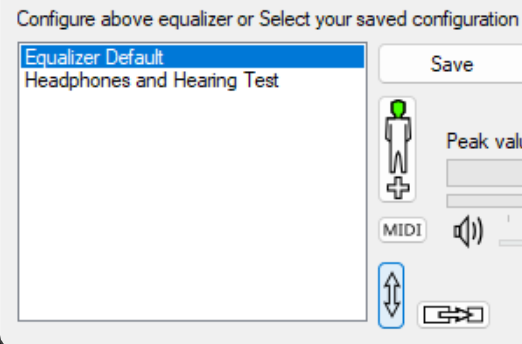

The appearance can be customised from `Settings` > `Appearance`.

Custom theme files can also be imported from `Settings` > `Appearance` > `Read Theme`.

The custom themes used in this guide can be downloaded from [releases](src/Peace)

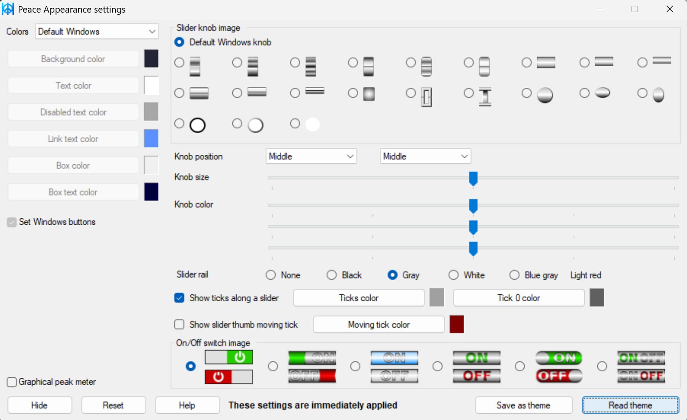

> [!NOTE]
> When importing, the `theme.ini` file may not appear in the File Explorer preview. This is normal, just select the folder that `theme.ini` is in.

### 3. Use AutoEQ

1. Open Squiglink

In your web browser, navigate to <https://squig.link/>

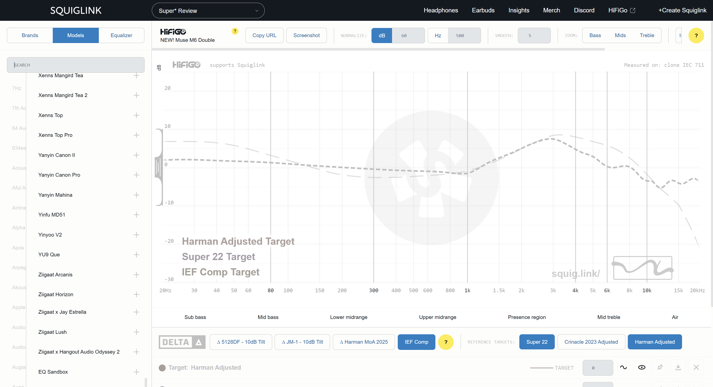

2. Select your device

Using the device tab on the left, search and select the device you want to EQ. (e.g. Moondrop Blessing 3)

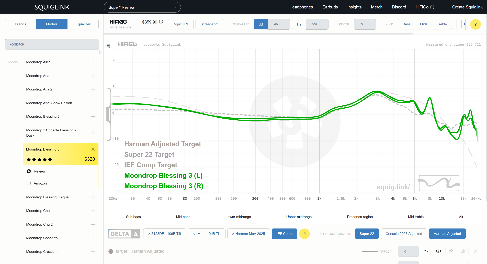

3. Select target

Search and select the device you want to EQ *to*. (e.g. ThieAudio HYPE 4)

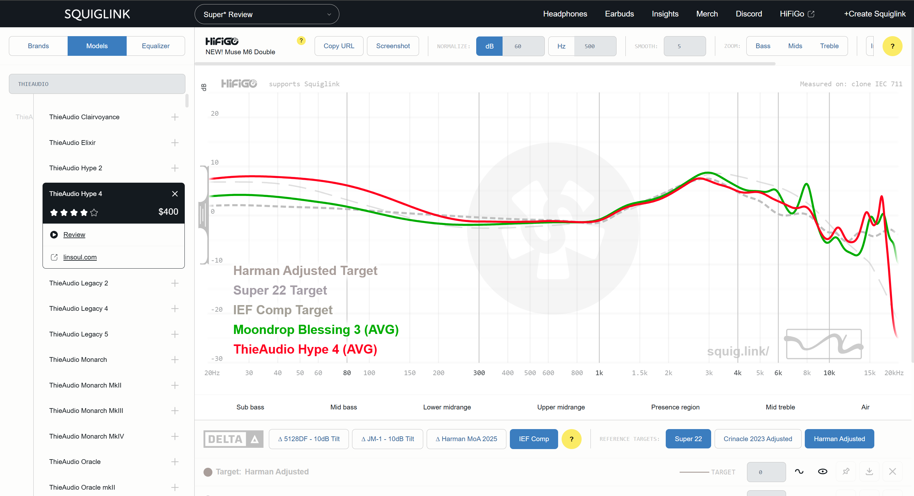

4. Switch to Equalizer tab

At the top left, click on `Equalizer` to switch to the Equaliser tab.

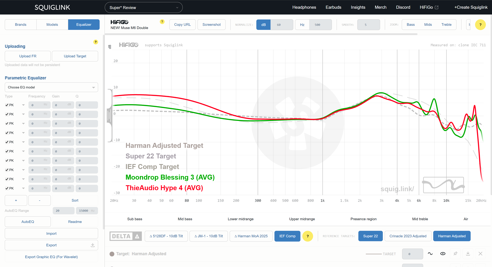

5. Remove other targets

In the bottom left panel, click on `X` for each of the other targets to remove them.

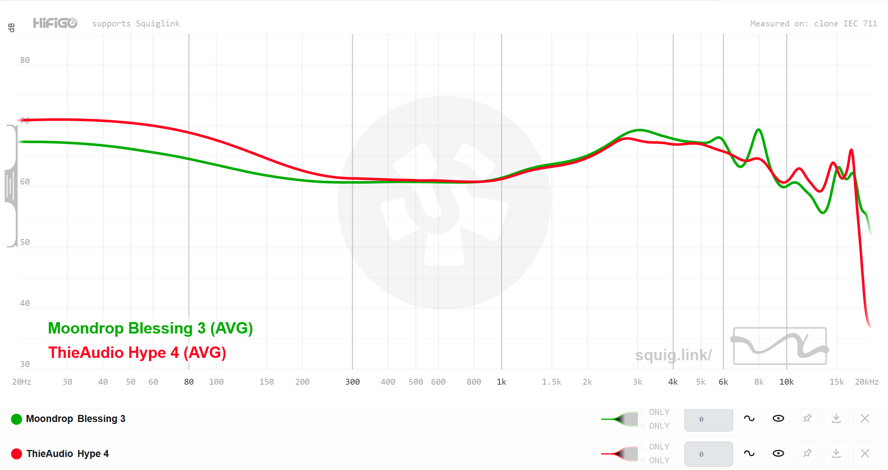

Only your device and selected target should be displayed now.

6. Select your device

Under `Parametric Equalizer` on the left, select the device you want to EQ. (Moondrop Blessing 3 in this case)

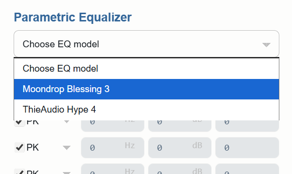

7. Run AutoEQ

At the bottom left, click on `AutoEQ` to run AutoEQ

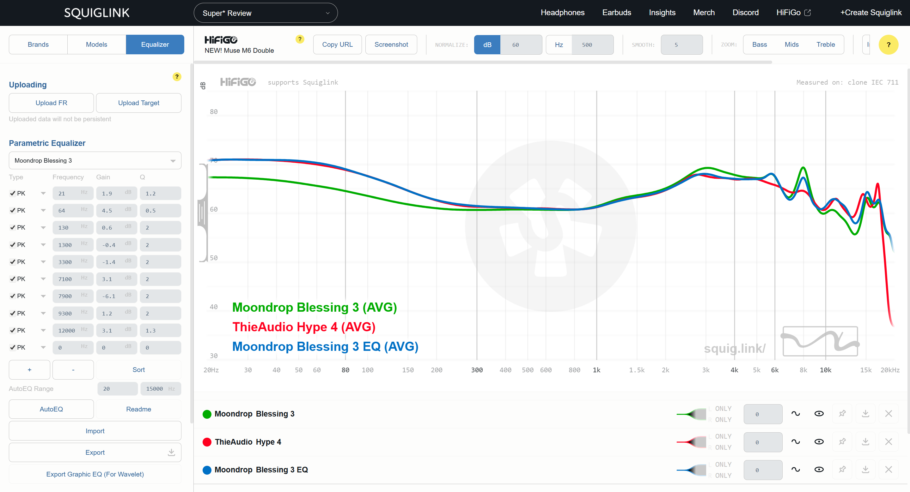

After a few seconds, the EQ settings and the modified frequency response curve should be generated.

8. Export EQ settings

At the bottom left, click `Export` to export the EQ settings as a `.txt` file.

9. Import EQ settings

Open Peace. On the right, click `Import` and select the `.txt` file. Select `Yes` when prompted to replace current equalization.

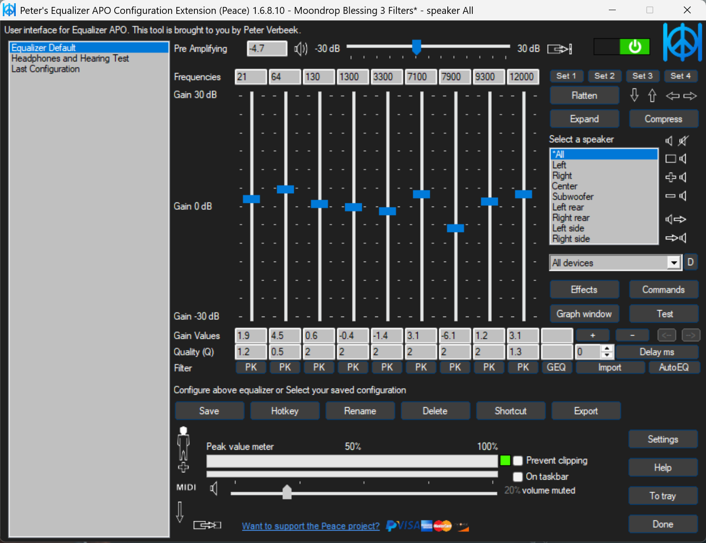

The EQ settings should be applied now.

> [!NOTE]
> By default, AutoEQ sets a negative pre-amplification in its EQ settings to prevent any clipping. This will reduce the overall volume of the device when applying the settings.
>
> This can sometimes be inconvenient. You can safely disable this in Peace by setting `Pre-amplifying` to `0`.

10. Save EQ settings

At the bottom left, click `Save` to configure and save the EQ settings as a new profile.

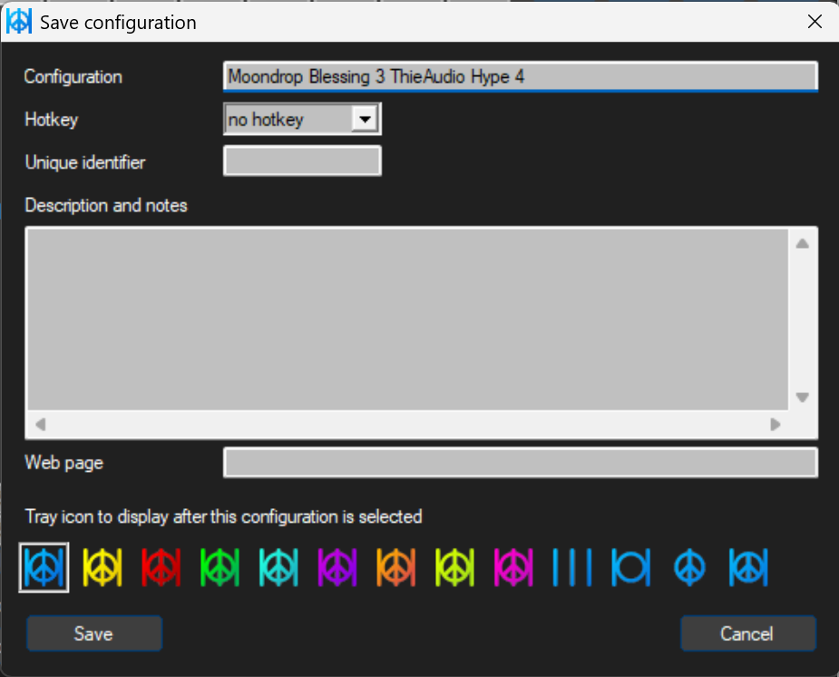

In the left panel, the new profile should be displayed now.

Profiles can be selected to apply the EQ settings anytime!

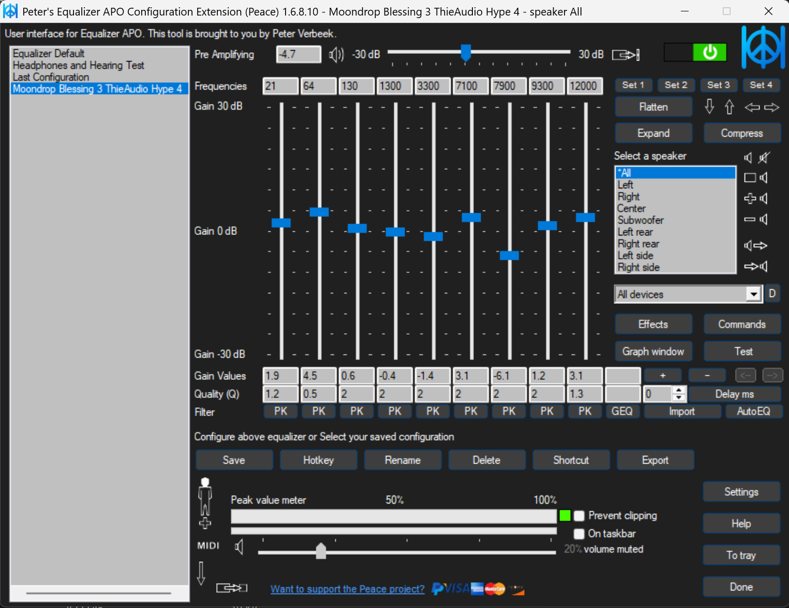

Repeat these steps to AutoEQ any device!